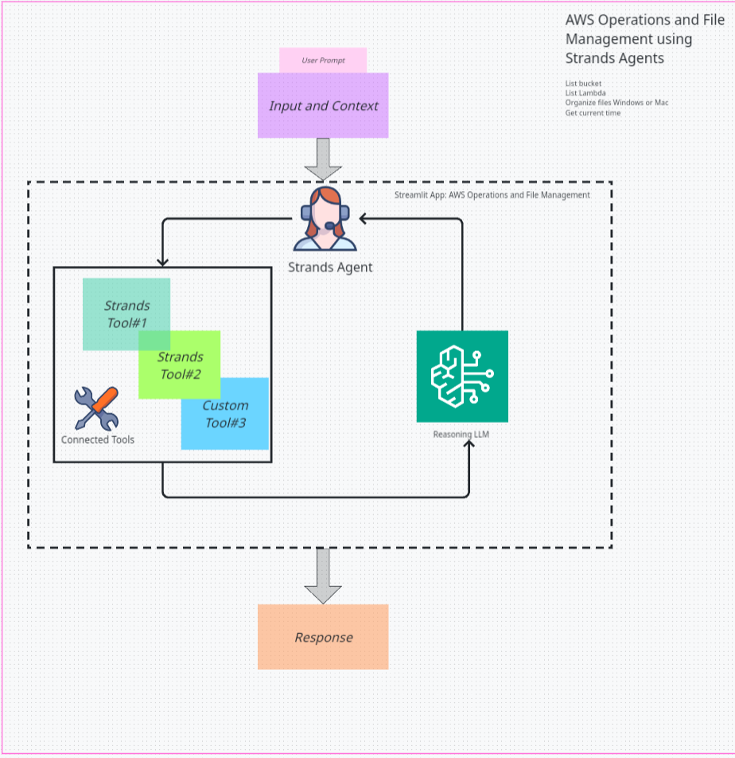

# AWS & File Management Assistant

A Streamlit application that combines AWS resource management with intelligent file organization using AI agents powered by Strands Agents Framework.

## ⚠️ DISCLAIMER

**USE AT YOUR OWN RISK:** This code is provided as-is for educational and demonstration purposes only. Amazon Web Services (AWS) is not responsible for any damages, data loss, costs, or issues that may arise from using this application. Users are solely responsible for:

- Testing in safe, non-production environments
- Backing up important data before use
- Understanding AWS costs and potential charges
- Ensuring proper security and access controls
- Any consequences of file operations or AWS resource management

By using this application, you acknowledge and accept full responsibility for all outcomes.

## 🚀 What This App Does

This application provides a **natural language interface** to manage your AWS infrastructure and organize your local files. Simply ask questions in plain English or use quick action buttons to:

- **Manage AWS Resources**: Query S3 buckets, EC2 instances, Lambda functions, and monitor costs
- **Organize Files**: Automatically sort files by type into organized folders
- **Multi-Region Support**: Switch between AWS regions seamlessly
- **Real-Time Operations**: Get instant results with live feedback

## ✨ Key Features

### AWS Operations
- 🪣 **S3 Management**: List buckets, filter by patterns, check sizes
- 💻 **EC2 Monitoring**: View instances, check status across regions
- ⚡ **Lambda Functions**: List functions, analyze performance
- 💰 **Cost Tracking**: Monitor AWS billing and usage
- 🌍 **Multi-Region**: Support for 7 major AWS regions

### File Organization
- 📁 **Smart Sorting**: Automatically categorize files by type
- 🔄 **Cross-Platform**: Works on Windows, macOS, and Linux
- 📊 **Detailed Reports**: See before/after states and file movements
- 🛡️ **Safe Operations**: Handles duplicates and preserves data

### User Experience
- 💬 **Natural Language**: Ask questions like "Show running instances"
- 🚀 **Quick Actions**: Pre-configured buttons for common tasks
- 📱 **Responsive Design**: Clean, intuitive interface
- 🔒 **Secure**: Standard AWS credential handling



## 📋 Requirements

- **Python**: 3.10 or higher
- **Operating System**: Windows, macOS, or Linux
- **AWS Credentials**: Required for AWS operations (optional for file organization)
- **AWS Bedrock Access**: Must have access to Anthropic Claude 3.5 Haiku model in AWS Bedrock

## 🛠️ Installation

### Step 1: Verify Python Version

**Windows:**
```cmd
python --version
```

**Mac:**
```bash
python3 --version
```

*Ensure you have Python 3.10 or higher*

### Step 2: Create Virtual Environment

**Windows:**
```cmd
# Create virtual environment
python -m venv venv

# Activate virtual environment
venv\Scripts\activate
```

**Mac:**
```bash
# Create virtual environment
python3 -m venv venv

# Activate virtual environment
source venv/bin/activate
```

### Step 3: Install Dependencies

**Install from requirements.txt (Recommended):**
```bash
pip install -r requirements.txt
```

### Step 4: Configure AWS & Enable Bedrock

**Configure AWS Credentials:**
```bash
aws configure
```

Or set environment variables:
```bash
export AWS_ACCESS_KEY_ID=your_access_key
export AWS_SECRET_ACCESS_KEY=your_secret_key
export AWS_DEFAULT_REGION=us-east-1
```

**Enable Claude 3.5 Haiku in AWS Bedrock:**
1. Go to AWS Console → Amazon Bedrock
2. Navigate to "Model access" in the left sidebar
3. Click "Request model access"
4. Find "Anthropic Claude 3.5 Haiku" and click "Request access"
5. Wait for approval (usually instant for most accounts)
6. Ensure your region supports Bedrock (us-west-2, us-east-1, etc.)

### Step 5: Run the Application

**Both Windows & Mac:**
```bash
streamlit run AWS_file_mgmt_assistant.py
```

## ⚠️ Important Safety Warning

**🚨 FILE ORGANIZATION SAFETY:**
- **DO NOT** run file organization on system drives (C:, root directories)
- **DO NOT** use on important folders like Downloads, Documents, Desktop
- **ONLY** use on dedicated test folders you create specifically for testing
- This app is for **educational purposes** to demonstrate Strands Agents capabilities
- Always backup important files before testing

**Safe Test Folder Examples:**
- `C:\Users\YourName\TestFolder`
- `/Users/YourName/TestFolder`
- `/home/username/TestFolder`

## 🎯 How to Use

### Getting Started
1. **Launch the app** - Run the Streamlit command above
2. **Open your browser** - Navigate to http://localhost:8501
3. **Select AWS region** - Choose from the dropdown (default: us-east-1)

### AWS Operations
- **Type natural language queries**: "List all S3 buckets"
- **Use quick action buttons**: Click pre-configured options in sidebar
- **Switch regions**: Select different AWS regions for queries

**Example Queries:**
- "Show me buckets starting with 'data'"
- "How many EC2 instances are running?"
- "List Lambda functions with errors"
- "What's my AWS cost summary?"

### File Organization
- **Enter folder path**: Type the full path to organize
- **Click organize button**: Files will be sorted automatically
- **View results**: See detailed before/after reports

**Safe Test Folder Paths:**
- Windows: `C:\Users\YourName\TestFolder`
- Mac: `/Users/YourName/TestFolder`
- Linux: `/home/username/TestFolder`

**⚠️ NEVER use system folders like:**
- `C:\` or `/` (root drives)
- `C:\Users\YourName\Downloads`
- `C:\Users\YourName\Documents`
- `C:\Users\YourName\Desktop`

## 📁 File Categories

Files are automatically organized into:
- **Documents**: Word, Excel, PowerPoint, PDF
- **Media**: Images, Videos, Audio files
- **Archives**: ZIP, RAR, TAR files
- **Code**: Python, JavaScript, HTML, CSS
- **Executables**: Platform-specific executable files
- **Other**: Unrecognized file types

## 🔄 Managing Your Environment

**To reactivate later:**

**Windows:**
```cmd
venv\Scripts\activate
streamlit run AWS_file_mgmt_assistant.py
```

**Mac:**
```bash
source venv/bin/activate
streamlit run AWS_file_mgmt_assistant.py
```

**To deactivate:**
```bash
deactivate
```

## 🆘 Troubleshooting

**Common Issues:**
- **Python Version**: Ensure Python 3.10+ (`python --version`)
- **Virtual Environment**: Always activate before running
- **AWS Permissions**: Verify credentials have proper permissions
- **File Permissions**: Run as administrator for system folders
- **Import Errors**: Reinstall dependencies in virtual environment

**Quick Fixes:**
- Restart the Streamlit app if it becomes unresponsive
- Check AWS credentials if getting permission errors
- Use full file paths for file organization
- Ensure virtual environment is activated before each session


## Security

See [CONTRIBUTING](CONTRIBUTING.md#security-issue-notifications) for more information.

## License

This library is licensed under the MIT-0 License. See the LICENSE file.

